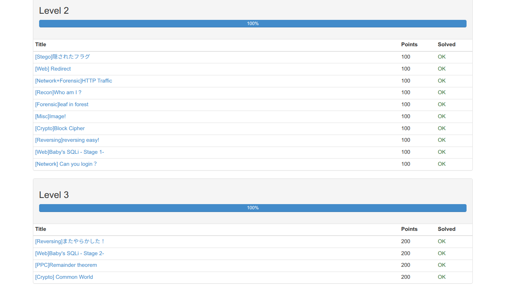

# cyber_security_tools
### ctf(Capture The Flag)とは？
	webサイトなどで用意されたFLAGと呼ばれる情報を探し出す旗取り競技
	出題方式は様々。出題方式も様々で暗号解析はsha,base64などの暗号化された文字列の復号、
	ネットワークは不純なデータが混ざっていないかの特定、
	idea問題は暗号解析に似ており、特定の文字列を復号したり、場所や端末の特定などがある。
	programは,自身でプログラムを書いてサーバで実行するとフラッグが返る。接続方法は指定されることが多い
	フォレンジックはデータの復元で画像やプログラムの復元
##### 参考サイト
- [ctfの入門](https://qiita.com/s-mori/items/300765d8b2a89bcf5461)
- [ctf体験談](https://www.skyseaclientview.net/media/article/4813/)

### ctfの練習サイト
- [CpawCTF](https://ctf.cpaw.site/)
- [CELTF](https://play.celtf.com/#/)
- [flAWS](http://flaws.cloud/)
- [cryptohack.org](https://cryptohack.org/challenges/introduction/)
### 昨年度の感想
	昨年度はセキュリティに対する面白そうという興味だけで,何もわからないままctfの過去問を解きました。
	過去問対策でcpawを活用したのですが,分からなすぎて,多少,理不尽と思いながらも頑張って食いつきました。
	大会当日、先輩たちに囲まれて緊張が走る。大会の雰囲気は思ったより和やかで会話が多かったのが意外でした。
	大会終了後、先輩たちと団欒をして楽しく終わることが出来ました。
	\(先輩曰く、プログラムの問題はプログラムを使わずに力技で解いたとか\)
### 意気込み
	今年は優勝を狙いたいです。昨年度は、何も分からずにネットワーク問題やプログラム問題を分かる問題から着手しました。
	今年度は解ける問題は素早く解けるように練習したいです。
	また、量子ビットの問題など、解いたこともない問題にも、慌てずに対処出来るような知識と自身を身につけれたら良いなと思います。

### 要望
- 今年度の大会はリベンジなので昨年度と同じチームで挑みたいです。
- 大会は出来ることを知っていることが重要だと思うので、容赦なく勧めてほしい。
- 時間が残っているのであれば,一つの手法だけでなく複数の手法での解き方を教わりたいです。

### 課題
##### ctf

##### インストールマニュアル
- [apache2_server.md](apache2_server.md)
- [ftp_server.md](ftp_server.md)
- [telnet.md](telnet.md)
